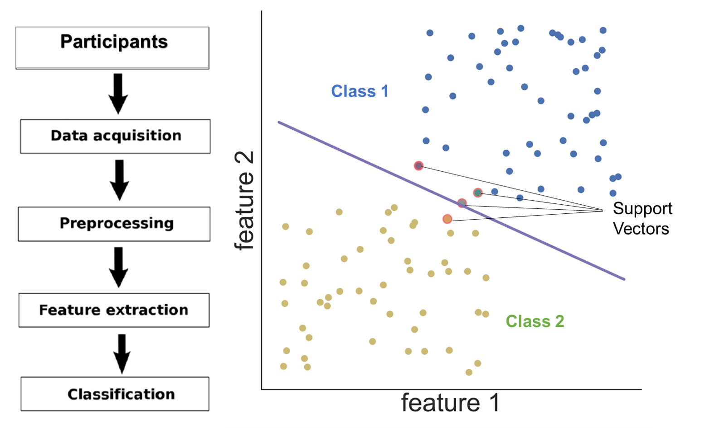
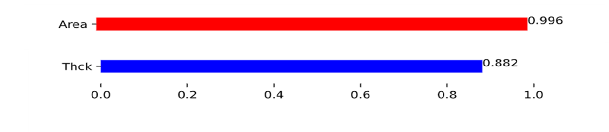
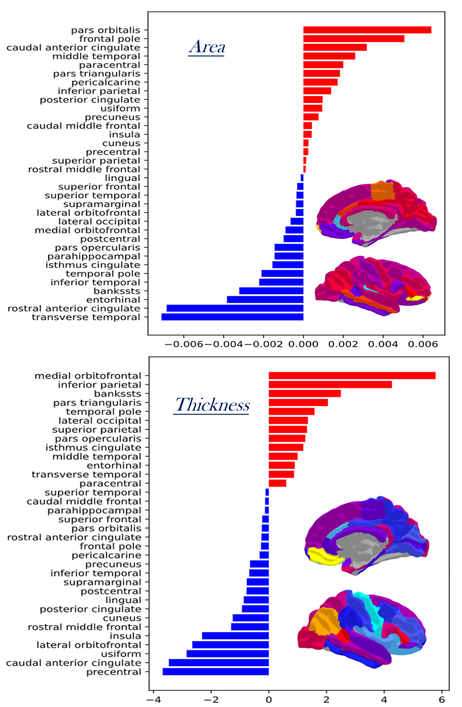

# Machine-Learning-Reveals-Hemispheric-Differences-in-the-Human-Brain
### This is the code part of the poster "Machine Learning Reveals Hemispheric Differences in the Human Brain" of 2022 OHBM (Organization for Human Brain Mapping) annual meeting
The code includes the part of applying machine learning methods (SVM) to HCP database from young group (22-35)
### Sources Useful for This Project:
My project containers: 1. [Poster](poster_Haoyu_Hu_OHBM_2022.pdf) 2. [Code](code_explore_brain_asymmtry.ipynb) 3. [Video](video_Haoyu_Hu_OHBM_2022_2.mp4) 4. [Slides](poster_Haoyu_Hu_OHBM_2022.pptx)
<br> HCP (Human Connectome Project) Homepage : [HCP](https://www.humanconnectome.org/)
<br> OHBM 2022 Homepage : [OHBM 2022](https://www.humanbrainmapping.org/i4a/pages/index.cfm?pageid=4114)
<br> Link to my poster (must be the member of OHBM 2022 first!): [MY POSTER](https://event.fourwaves.com/cbd65d58-69ab-466d-aa7a-a22731980df6/abstracts/b728357e-151c-4394-be09-4b5d074fbb96)
### Project Introduction:
```
Hemispheric asymmetry is a cardinal feature of human brain organization.
Altered brain asymmetry has also been linked to some cognitive and neuropsychiatric disorders.
While in previous studies univariate approaches were used, we applied a multivariate machine learning approach to explore whether/how well multimodal brain imaging measures could be used in combination to identify the hemispheric differences.
```
So **to what extent** can we distinguish the two hemispheres from regional neuroimaging measures? 
### Project Method:
I apply a machine learning method called Support Vector Machine (SVM) to classify the left and the right hemi from a global view.
<br>The following is the Method Process:
  
### Project Results:
The results are very impressive, which showed the great performance of SVM on HCP database
<br> Global Result:

<br> Local importance of brain regions (using DK atlas, freesurfer)

